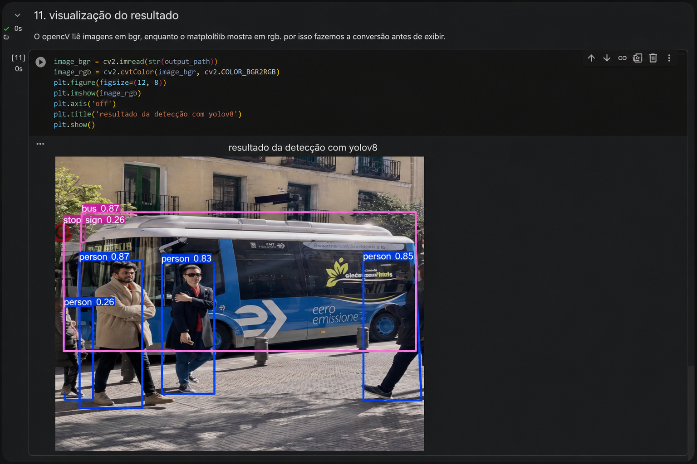

# YOLO Object Detection DIO

Projeto simples de detecção de objetos com YOLO, feito para o desafio da DIO.

A ideia aqui foi montar um fluxo funcional: rodar inferência com um modelo pré-treinado, gerar uma imagem com as detecções e deixar documentado o caminho para evoluir isso para transfer learning com uma base própria.

Não treinei um modelo do zero neste projeto. A demonstração usa YOLO com Ultralytics e pesos pré-treinados, o que já é suficiente para mostrar bem o funcionamento da detecção de objetos.

## Descrição

Este repositório organiza um exemplo de visão computacional usando YOLOv8. O modelo recebe uma imagem, identifica objetos conhecidos e devolve o resultado com bounding boxes, nome da classe e nível de confiança.

O projeto foi pensado para ser fácil de rodar no Google Colab, mas também tem um script local em Python para testar imagens na máquina.

## Objetivo

O objetivo principal é demonstrar detecção de objetos de forma prática e documentada.

Também deixei o fluxo preparado para servir como base de um treinamento futuro por transfer learning, usando um dataset customizado no formato YOLO.

## O que foi feito

- criação de um notebook para execução no Google Colab;
- uso do modelo `yolov8n.pt` da Ultralytics;
- inferência em imagem com detecção de objetos;
- geração de resultado visual com bounding boxes;
- script local para rodar a detecção em imagens da pasta `images/input`;
- organização básica de pastas para imagens, dataset, código e documentação;
- documentação do caminho para criar uma base customizada e treinar por transfer learning.

## Tecnologias

- Python
- Google Colab
- YOLOv8
- Ultralytics
- OpenCV
- Matplotlib

## Como rodar no Colab

1. Abra o arquivo `notebooks/yolo_object_detection_colab.ipynb` no Google Colab.
2. Execute as células em ordem.
3. O notebook instala a biblioteca `ultralytics`.
4. O modelo `yolov8n.pt` é carregado.
5. A inferência é executada em uma imagem de exemplo.
6. O resultado é exibido no próprio notebook e salvo em `images/output/`.

O Colab é o caminho mais simples para testar o projeto, principalmente porque evita configuração local de ambiente.

## Como rodar localmente

Crie um ambiente virtual:

```bash
python -m venv .venv
```

Ative o ambiente no Windows:

```bash
.venv\Scripts\activate
```

Instale as dependências:

```bash
pip install -r requirements.txt
```

Coloque uma imagem dentro da pasta:

```text
images/input/
```

Execute o script:

```bash
python src/detect.py
```

As imagens processadas são salvas em:

```text
images/output/
```

## Resultado

Abaixo está um exemplo visual do resultado da detecção:



O resultado pode variar conforme a imagem usada, a iluminação, a qualidade da foto e as classes que o modelo pré-treinado já conhece.

Neste projeto, o foco é demonstrar o fluxo de inferência e a organização para uma possível customização futura.

## Estrutura

```text
yolo-object-detection-dio/
├── README.md
├── requirements.txt
├── notebooks/
│   └── yolo_object_detection_colab.ipynb
├── src/
│   └── detect.py
├── images/
│   ├── input/
│   ├── output/
│   ├── results/
│   │   └── yolo-detection-result.png
│   └── README.md
├── dataset/
│   └── README.md
└── docs/
    └── entrega_dio.md
```

## Observações sobre transfer learning

O projeto documenta o caminho para transfer learning, mas não apresenta um treinamento customizado como se ele tivesse sido executado.

Para treinar um modelo com classes próprias, seria necessário preparar uma base anotada no formato YOLO, com imagens e labels separados em treino e validação:

```text
dataset/
├── images/
│   ├── train/
│   └── val/
├── labels/
│   ├── train/
│   └── val/
└── data.yaml
```

Um exemplo simples de `data.yaml`:

```yaml
path: /content/yolo-object-detection-dio/dataset
train: images/train
val: images/val

names:
  0: dog
  1: bicycle
```

Com a base pronta, o treinamento por transfer learning poderia ser iniciado assim:

```bash
yolo detect train model=yolov8n.pt data=dataset/data.yaml epochs=30 imgsz=640
```

Nesse caso, o modelo pré-treinado seria usado como ponto de partida. Isso costuma ser mais viável do que começar do zero, principalmente quando a base customizada ainda é pequena.

## Conclusão

Este projeto mostra um fluxo básico, mas completo, de detecção de objetos com YOLO e Ultralytics.

Ele roda inferência com um modelo pré-treinado, salva o resultado visual e deixa claro como o mesmo projeto poderia evoluir para um treinamento customizado com transfer learning.

Para o objetivo do desafio, preferi manter a entrega honesta: demonstrar a detecção funcionando e documentar o próximo passo sem inventar métricas ou resultados de treinamento que não foram feitos.

## Próximos passos

- montar uma base própria com pelo menos duas classes;
- rotular as imagens com Labelme, Roboflow ou ferramenta parecida;
- converter as anotações para o formato YOLO, se necessário;
- treinar o modelo no Colab usando `data.yaml`;
- comparar métricas como precision, recall e mAP;
- testar outras versões ou tamanhos de modelo YOLO;
- adicionar inferência em vídeo.
